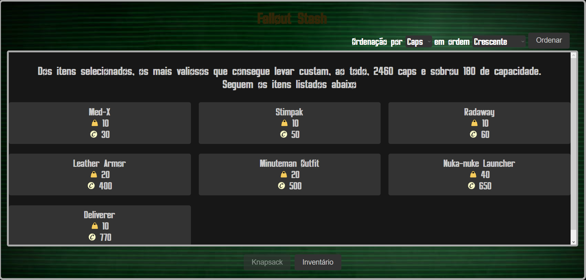

# Fallout Stash

**Número da Lista**: 9 
**Conteúdo da Disciplina**: D&C 

## Alunos
|Matrícula | Aluno |
| -- | -- |
| 19/0093196  |  Mateus Caltabiano Neves Frauzino |
| 19/0093480  |  Matheus Soares Arruda |

## Sobre 
Nosso projeto tem como objetivo utilizar o algoritmo knapsack para devolver os itens que melhor preenchem uma mochila de modo a maximizar o valor levado. Após selecionar os itens, também é possível filtrar a mochila retornada em ordem de peso, nome e valor, tanto crescente quanto decrescente, utilizando um algoritmo de dividir e conquistar

## Screenshots

## Instalação 
**Linguagem**: HTML, CSS e Javascript 

## Uso 
Para utilizar nosso projeto, basta abrir a github pages. Na tela inicial temos um texto para ambientar o usuário e um botão "Caps aqui" para abrir a tela do knapsack. Nela, basta selecionar os itens que quer que o algoritmo considere e clicar em "Knapsack", ele vai devolver a melhor otimização que preencha sua mochila de maneira a carregar os itens mais valiosos. Para selecionar outros itens, basta clicar em Inventário. Após o preenchimento da mochila, vai aparecer uma opção para ordená-la. Basta selecionar a ordenação por caps, nome ou peso tanto crescente quanto descrescente e clicar em filtrar.

## [Entrega](./entrega.md)

